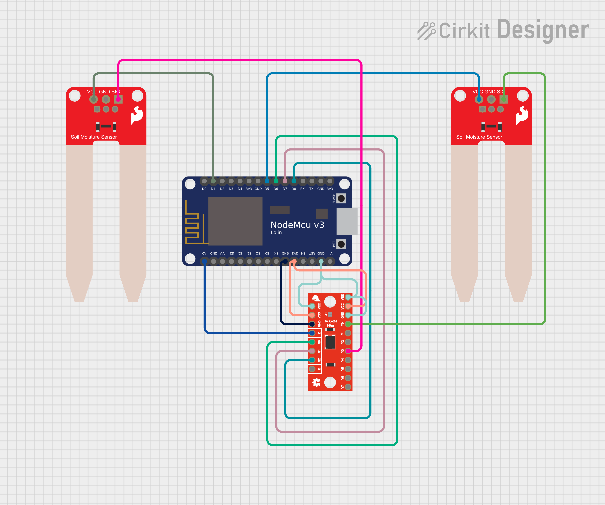
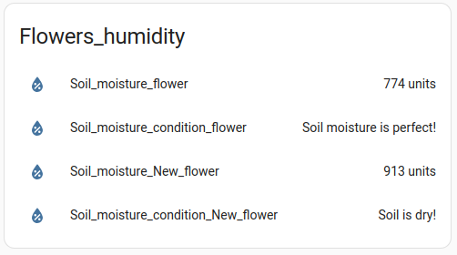

<h1>This project is about measuring soil moisture in two points and transmit data to Home Assistant via MQTT</h1> 
For project we need controller ESP8266, soil hydrometer sensor LM393 (or any other), analog 8-channel muliplexor CD4051. We have to use analog multiplexor here since ESP8266 contain only one analog input A0, but we want to connect two soil moisture sensors.

<h1>Circuit schema</h1>

<b>Libs:</b>
DHT11 by Author: Dhruba Saha
PubSubClient by Nick 'O Leary

<h3>Below useful information regarding connecting ESP8266 to Home Assistant, Pinoits of ESP8266 and analog multiplexor CD4051</h3>
For connecting to HA via MQTT: 
https://www.home-assistant.io/blog/2015/10/11/measure-temperature-with-esp8266-and-report-to-mqtt/

How to connect/programm ESP8266: 
https://www.instructables.com/NODEMcu-Usb-Port-Not-Working-Upload-the-Code-Using/

ESP8266 Pinout Reference: 
https://randomnerdtutorials.com/esp8266-pinout-reference-gpios/

Example of connecting: 
https://lastminuteengineers.com/soil-moisture-sensor-arduino-tutorial/#google_vignette

Example of connecting multiplexer CD4051: 
https://www.instructables.com/How-to-Use-Multiple-Analog-Sensors-on-Your-ESP8266/

<h1>Attention!</h1>
In simple terms: 
When you are ready to upload your code to the board
Connect (Serial Converter -> NodeMCU board): 
[1] RX -> TX 
[2] TX -> RX 
[3] 5v -> VIN (not 3.3v to VIN, but 5v to VIN, notice no ambiguity there) 
[4] GND -> GND 
[5] Button Sequence: Hold down the Flash button and tap and release Rst button, then after about 1sec release Flash (read that twice) - be sure to keep the Flash button down while you first release the Rst button (if you do not do this, you will not put the board into upload/programming mode. As far as I can tell, it is safe to say that when you see the blue led flash, you can release the Flash button - but only knowing the wiring of the NodeMCU can you know for sure. Remember, the release of the Rst button causes the reset/start of the board. 

After the upload/programming is completed, your NodeMCU program should begin to execute - if not, press the Rst button to restart to brak out of programming mode. If you want to upload again you must follow the steps again as the board is no longer in upload/programming mode. A Wemos Esp-8266 will not work this way as there is no Flash button as there in on a NodeMCU board.

